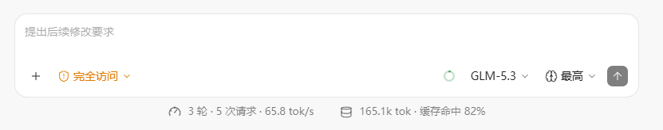
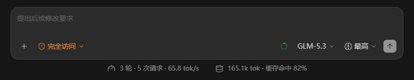

# ZCode 扩展 · 统计

`zcode-ext-stats` — 适用于 ZCode 的非官方会话统计扩展，与 ZCode 官方无关联。

在 ZCode 输入框下方居中显示当前会话的轮数、请求次数、输出速度、Token 用量和缓存命中率，点击可查看详细统计。

```text
5 轮 · 55 次请求 · 240 tok/s    5.8M tok · 缓存命中 98%
```

补丁只读查询客户端数据库，不新增、修改或删除数据库记录。安装时修改客户端的 `app.asar`，并创建备份。

## 界面预览

浅色主题：



深色主题：



截图中的模型和统计数值仅用于展示界面效果。


## 环境要求

- Python 3.10 或更高版本，无需安装额外 Python 依赖。
- ZCode 主进程需支持 `node:sqlite`；当前实现已针对 ZCode 3.12.2 核对。
- 支持 Windows、macOS 和 Linux 的安装位置探测，也可手动指定安装目录或 `app.asar` 路径。其他客户端版本应先检查兼容性。

## 安装与更新

先完全退出 ZCode，再在项目目录执行：

```powershell
python scripts/zcode_ext_stats.py "<ZCode安装目录>"
```

不指定路径时，脚本自动探测安装位置：

```powershell
python scripts/zcode_ext_stats.py
```

成功后脚本自动启动 ZCode。脚本不会结束运行中的进程；文件被占用时会提示手动退出，再重新执行。自动启动失败时，可手动启动客户端。

原来的命令仍可使用，`--tps-footer` 与默认行为相同：

```powershell
python scripts/zcode_ext_stats.py "<ZCode安装目录>" --tps-footer
```

补丁更新后重新执行同一命令即可，不必先还原。内容相同时跳过写入，不会重复叠加脚本。客户端升级可能覆盖补丁，需要重新检查并安装。

## 检查与还原

只检查注入状态，不修改文件或启动客户端：

```powershell
python scripts/zcode_ext_stats.py "<ZCode安装目录>" --check
```

完全退出 ZCode 后移除补丁：

```powershell
python scripts/zcode_ext_stats.py "<ZCode安装目录>" --revert
```

还原会移除统计脚本和对应入口，并清理补丁备份及记录；不会自动启动客户端。`--check` 只检查结构和注入状态，不等同于完整运行验证。

| 参数 | 说明 |
|---|---|
| 安装目录或 `app.asar` 路径 | 可选；不提供时自动探测 |
| `--tps-footer` | 可选，兼容原安装命令 |
| `--check` | 检查状态 |
| `--revert` | 移除补丁，与 `--check` 互斥 |
| `--tps-src 路径` | 使用指定的渲染脚本；统计后端仍使用项目自带文件 |

## 界面使用

- 指标栏默认隐藏；当前会话查询到至少一条模型用量记录后才显示。首次调用尚未落库时，实时 TPS 也隐藏。
- 有历史记录的会话，查询成功后直接显示。切换会话会重新判断，避免显示上一会话的数据。
- 点击“会话统计”或“Token 用量”打开对应详情。再次点击、点击外部或按 Escape 关闭；支持 Enter/Space 激活，悬停不会展开。
- 生成过程中底栏显示带 `≈` 的实时估速，结束后恢复平均 TPS；弹窗始终显示平均 TPS。
- 已显示后遇到临时查询失败，保留指标栏并提示不可用。

模型调用完整结束并成功落库后，用量通常在下一次查询时更新。页面可见时约每 2 秒查询一次，后台页面暂停定时查询。整轮尚未落库时，可能显示 `0 轮`，即使已有模型请求记录。

## 统计口径

统计当前会话，不自动合并子代理的独立会话。

| 指标 | 算法 |
|---|---|
| 轮数 | 当前会话 `turn_usage` 记录条数，不补计实时轮次 |
| 请求次数 | `model_usage` 记录条数，不等于底层 HTTP 请求次数或工具调用次数；标题生成等辅助调用也可能计入 |
| 模型用时 | 累计模型记录的 `duration_ms` |
| 工具用时 | 累计工具记录的 `duration_ms`；并行调用分别累加，不代表实际经过的总时间 |
| 平均首 token 延迟（TTFT） | 对非空 `time_to_first_token_ms` 做算术平均；没有记录时显示 `—` |
| 平均输出速度（TPS） | 有效调用的累计输出 token ÷ 累计从首 token 到完成的耗时（秒） |
| 总 Token | 归一化输入 token + 输出 token |
| 缓存命中率 | 累计缓存读取 token ÷ 累计归一化输入 token；输入为零时显示 `—` |
| 未缓存输入 | 归一化输入减去缓存读取，包含缓存写入 |

### 平均 TPS

只计算输出 token 大于 0、首 token 和完成时间存在、输出耗时有限且大于 0 的记录。无效记录的输出和耗时同时排除；没有有效记录才显示 `—`。该筛选不影响请求次数和 Token 总量。

这不是各次 TPS 的算术平均，也不是服务端纯解码速度：它排除了首 token 前的等待，但包含同一次调用内的停顿。标题生成等调用可能有用量而没有首 token 时间，因此不参与平均 TPS。

客户端将首个非空文本或思考增量事件的时间记为首 token 时间。主对话的 TTFT 从本地调用准备阶段开始计算，不是纯网络或服务端等待时间。

### 实时 TPS

使用最近 4 秒的文本增量估算 token，累计采样不足 4 秒时使用实际采样时长：

- 中日韩字符约按每字符 1 token，其他字符约按每字符 0.25 token。
- 同时统计正文和思考文本，保留小数累计。
- 首批文本建立计时基线，显示“正在采样”；满 1 秒后显示数值，每秒最多更新一次。
- 超过 2 秒没有文本增量显示“等待输出”；工具执行阶段显示“工具执行中”。
- 实时估算仅在内存中使用，不写入数据库，也不累计到总用量。

### Token 与数据范围

输入量根据供应商总量或客户端计算总量与各项 token 的加和关系，判断是否需要补入缓存 token，避免重复计算。思考 token 不单独再加到总量。

数据来自 `~/.zcode/cli/db/db.sqlite` 的 `model_usage`、`turn_usage`、`tool_usage`。客户端通常清理约 30 天前的用量记录，因此不是永久历史统计。远程会话、自定义数据目录和已清理记录不保证可查询。

## 备份说明

备份位于客户端 `resources` 目录：

| 文件 | 用途 |
|---|---|
| `app.asar.tps.bak` | 首次安装时的完整资源包备份；存在时不覆盖 |
| `app.asar.tps-patch.json` | 补丁入口恢复信息；实际更新时刷新 |

客户端升级后，如果旧备份仍存在，脚本不会自动确认备份版本。不要直接用旧版 `.bak` 覆盖新版客户端。移除补丁优先使用 `--revert`。

重打包先写临时文件，校验注入内容后替换 `app.asar`。程序只暴露汇总查询接口，不向界面返回会话正文或凭据。

## 项目文件

| 文件 | 用途 |
|---|---|
| `scripts/zcode_ext_stats.py` | 安装、更新、检查、还原和启动客户端 |
| `scripts/zcode-ext-stats.js` | 指标栏、点击详情和实时 TPS |
| `scripts/zcode-ext-stats-main.cjs` | 只读数据库查询和统计计算 |
| `tests/` | 单元测试、浏览器回归脚本和模拟预览页 |

## 开发验证

从项目目录执行；JavaScript 测试需要支持 `node:sqlite` 的 Node.js：

```powershell
node --test tests/session-stats.test.cjs tests/live-stats.test.cjs
python -B -m unittest discover -s tests -p test_*.py
```

启动模拟预览页：

```powershell
python -m http.server 8765 --bind 127.0.0.1
```

浏览器打开 `http://127.0.0.1:8765/tests/preview.html`。页面仅使用固定样例和模拟消息，不连接个人数据库。

Playwright MCP 可执行 `tests/browser-checks.js` 和 `tests/live-browser-checks.js`，检查详情交互、首次落库前隐藏、实时/平均速度、会话切换及工具状态。浏览器测试脚本中的截图输出路径需按项目实际位置调整。
